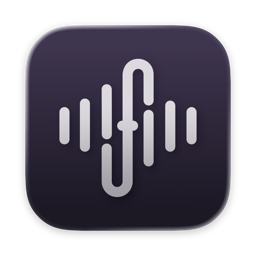

<p align="center">
  
</p>

# Freesper

Freesper is a dictation app for macOS. You speak, and the recognized text
appears in the app you're working in.

- Free and open source.
- Low memory footprint.
- Fast and private — all speech recognition runs on your device.

Requires macOS 14+ on Apple Silicon.

## Building from source

```
make dev
```
